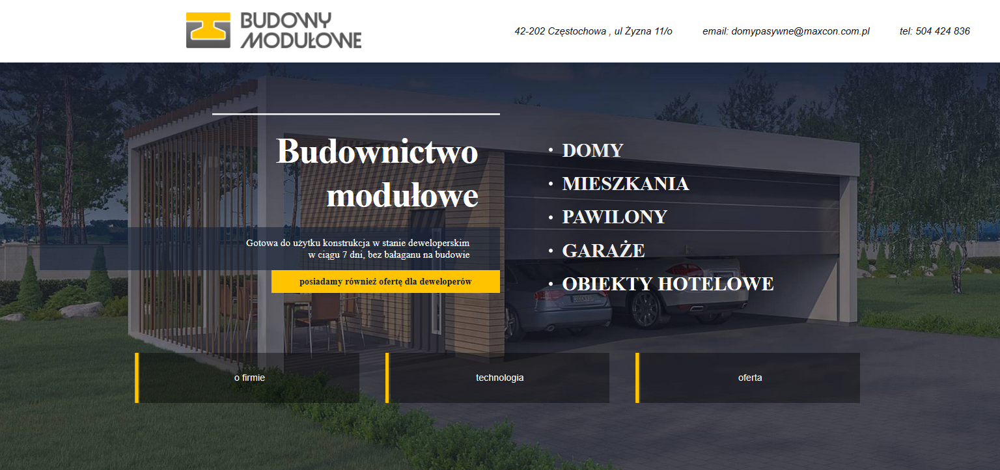
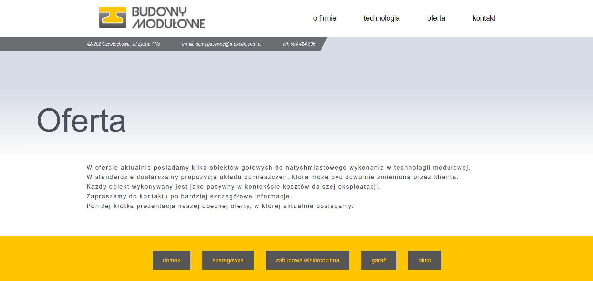
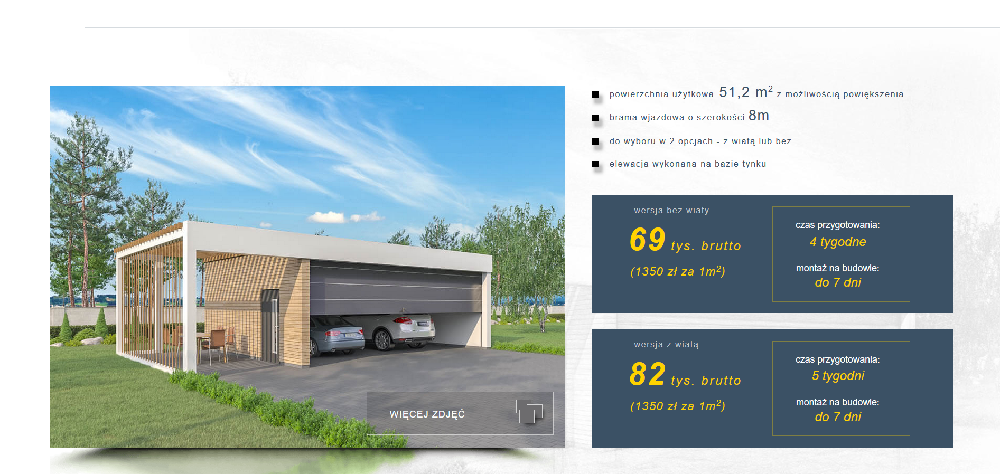
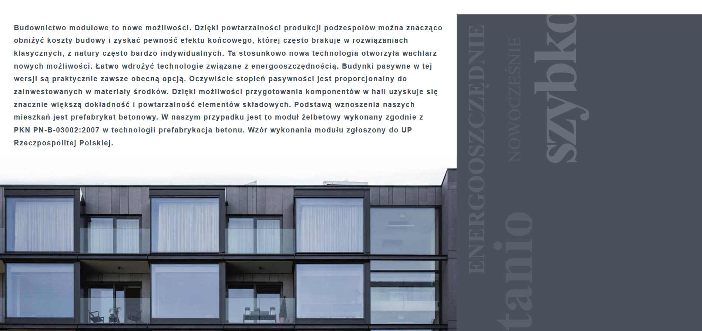

# #5 Developer
> This is my fifth website.
> It is the website of a construction developer specializing in the construction of modular buildings.
>
> [Developer](http://provo.webd.pro/moduly/index.html)

## Table of contents
* [General info](#general-info)
* [Screenshots](#screenshots)
* [Technologies](#technologies)
* [Status](#status)
* [Contact](#contact)

## General info
I made this project under the supervision of my mentor (https://www.jupiter.czest.pl/) who also made the website design.

The website was made in the desktop first approach.

## Screenshots

***

***

***

## Technologies
* CSS - vesrion 3
* HTML - vesrion 5
* JavaScript
* jQuery
* SCSS

### Extension
* [lightGallery](https://sachinchoolur.github.io/lightGallery/)

## Status
Project is: _finished_

## Contact
Created by [@Grzegorz Stącel](mailto:stacelgrzegorz@gmail.com) - feel free to contact me!
